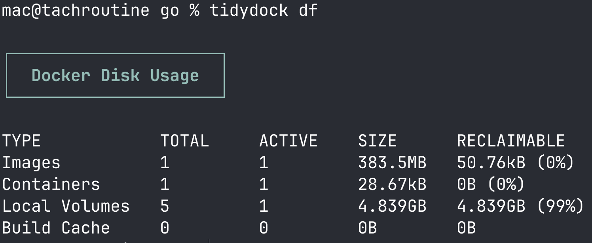

# tidydock

A tidy little CLI for messy Docker environments. Prune, clean and nuke with surgical precision — without losing what matters.

## Demo



## Installation

```sh
go install github.com/tacheraSasi/tidydock@latest
```

## Usage

```sh
tidydock <command> [flags]
```

### Commands

| Command      | Description                     |
| ------------ | ------------------------------- |
| `df`, `disk` | Show Docker disk usage          |
| `images`     | List all images                 |
| `ps`         | List all containers             |
| `volumes`    | List all volumes                |
| `stop-all`   | Stop all running containers     |
| `clean`      | Clean unused data (safe)        |
| `nuke`       | Remove everything (destructive) |
| `version`    | Show version                    |

### Flags

| Flag         | Description                                    |
| ------------ | ---------------------------------------------- |
| `--keep, -k` | Image name to preserve during `clean` / `nuke` |

### Examples

```sh
tidydock df                                  # check disk usage
tidydock images                              # list images
tidydock ps                                  # list containers
tidydock stop-all                            # stop all running containers
tidydock clean                               # prune unused data
tidydock clean --keep myapp                  # clean but keep "myapp" image
tidydock nuke                                # remove everything
tidydock nuke --keep postgres                # nuke but keep "postgres" image
```
